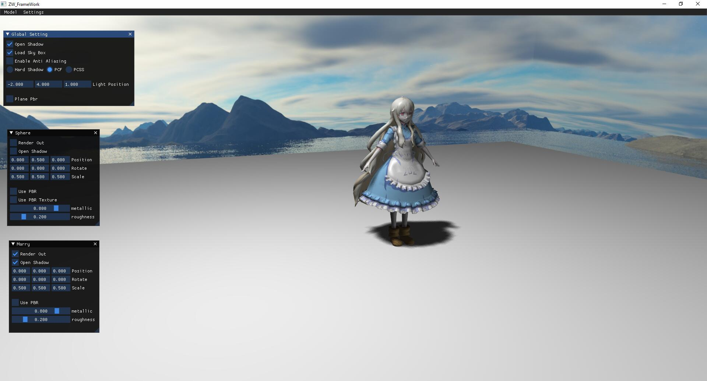

# ZW FrameWork

ZW FrameWork 是一个基于 OpenGL 的简单实时渲染框架，目前支持的特性有：

- 模型，贴图的导入和渲染
- 基于 ImGui 的 UI 界面，支持实时响应渲染参数调节
- 基于 MSAA 的反走样
- 实时阴影算法的实现，包括硬阴影算法，PCF 算法和 PCSS 算法
- PBR 材质，并支持金属度和粗糙度的实时调节以及带贴图的 PBR 材质
- Depth map 和 sky box 的渲染
- 支持可自定义的 fragment shader，支持 shader toy 代码移植

渲染结果示例：

